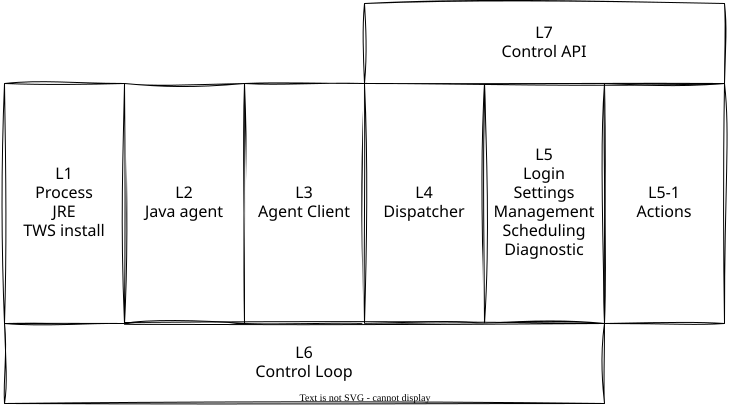

# Development environment

How to get `ibcontroller` itself, and the Java agent it drives, running locally.

## Target platform

The supported platforms are macOS and Linux.

## Python toolchain

```bash
curl -LsSf https://astral.sh/uv/install.sh | sh   # if uv isn't already installed
cd ibcontroller
uv sync                                           # installs the dev dependency group too
```

Requires Python 3.12+ (pinned in `.python-version`). Day-to-day commands:

```bash
uv run pytest                # test suite (pytest-asyncio, pytest-aiohttp already in the dev group)
uv run ruff check .          # lint
uv run ruff format .         # format
uv run pyrefly check         # type check
uv run bandit -c pyproject.toml -r ibcontroller/   # security lint
```

## pre-commit

`.pre-commit-config.yaml` (project root) runs ruff (lint + format), bandit, pyrefly, and basic
hygiene hooks (trailing whitespace, end-of-file, yaml/toml checks, large-file check) on every
commit — the same checks as the `uv run` commands above, wired to run automatically instead of by
hand.

```bash
uv run pre-commit install    # one-time per clone: installs the git hook
uv run pre-commit run --all-files   # run every hook against the whole tree, not just staged files
```

CI runs the same config, so a clean local `pre-commit run --all-files` is a reliable predictor of
CI passing.

## Java toolchain

The agent needs to build against, and run compatibly with, the JRE TWS/Gateway bundles.

**Local dev JDK, via SDKMAN:** a real Azul account/API token is needed for the exact SA-tier build
above; without one, the closest public match is Zulu's CA (Certified Availability) tier at the
same JDK version. SDKMAN manages that install and pins the version per project:

One-time install (adds SDKMAN's init to your shell rc automatically):

```bash
curl -s "https://get.sdkman.io" | bash
# install
sdk install java 17.0.15-zulu
```

The pinned Java version lives in `.sdkmanrc` at the project root (checked in):

```env
java=17.0.15-zulu
```

Activate it per clone — SDKMAN then sets `JAVA_HOME` for the current shell:

```bash
sdk env use   # reads .sdkmanrc; installs the pinned JDK on first use
java -version
openjdk version "17.0.15" 2025-04-15 LTS
OpenJDK Runtime Environment Zulu17.58+21-CA (build 17.0.15+6-LTS)
OpenJDK 64-Bit Server VM Zulu17.58+21-CA (build 17.0.15+6-LTS, mixed mode, sharing)
```

Enable auto-env (`sdkman_auto_env=true` in `~/.sdkman/etc/config`) to have `JAVA_HOME` set
automatically when entering the project directory, instead of running `sdk env use` in every new
terminal. Either way, `JAVA_HOME` is the contract: the `Makefile` reads it (`JDK ?= $(JAVA_HOME)`),
and CI's `actions/setup-java` (zulu 17) sets the same variable, so local and CI build with the
same pin.

This JDK is for *compiling* only — its own version doesn't need to match whatever Gateway/TWS
happens to bundle locally . The `Makefile`'s `--release 17` tells `javac` to target Java 17
bytecode/API regardless of which JDK compiles it, so the output runs correctly on whatever
JRE TWS/gateway is using.

The agent is small, so keep the build as plain
as it can be: `javac` + `jar`, wired through a small `Makefile`.

## TWS / IBKR Gateway itself

Download from IBKR directly [gateway](https://www.interactivebrokers.com/en/trading/ibgateway-latest.php) or [TWS](https://www.interactivebrokers.com/en/trading/download-tws.php). Then install.

After the first run, `ibcontroller` renames the gateway/TWS script. This is required to manage restarts.

## Building and attaching the agent

Java agent file structure:

```text
agent/src/main/java/ibcontroller/agent/
  AgentMain.java         — entry point: both sockets, EventBridge installed before Gateway launches
  Protocol.java          — command accept loop, hand-rolled JSON codec, full command dispatch
  ComponentLookup.java   — read-only Swing tree walk, dump/get_text
  WriteOps.java          — EDT-dispatched writes, set_text/set_checkbox/click
  EventBridge.java       — AWTEventListener install + NDJSON event forwarding
  Security.java          — password redaction, the credential-field boundary
```

Build using`Makefile`:

```bash
make build    # build/ibcontroller-agent.jar, then copies it into ibcontroller/ (for uv/pyproject packaging)
make dist     # build the jar, then uv build the Python package (jar is required package-data, see Makefile)
make clean    # rm -rf build dist
```

Day-to-day cycle: `make build` after any agent-side change, `uv run pytest` for the Python side,
`pre-commit run --all-files` before pushing.

## Running ibcontroller

```bash
# from the git repo
source .venv/bin/activate
ibcontroller run --dotenv=.env-paper --trading-mode=paper --program=gateway
```

## Architecture

`ibcontroller` follows a layered architecture with separation of concerns between layers.
Any contribution must follow this separation of concerns.


