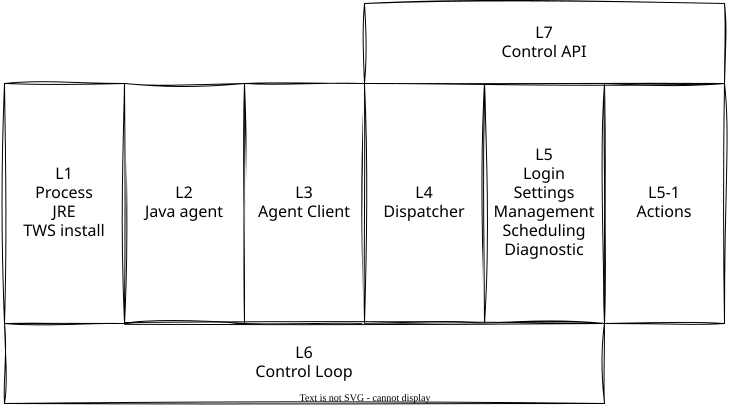

# Development environment

How to get `ibcontroller` itself, and the Java agent it drives, running locally.

## Target platform

The supported platforms are macOS and Linux.

## Python toolchain

```bash
curl -LsSf https://astral.sh/uv/install.sh | sh   # if uv isn't already installed
cd ibcontroller
uv sync                                           # installs the dev dependency group too
```

Requires Python 3.12+ (pinned in `.python-version`). Day-to-day commands:

```bash
uv run pytest                # test suite (pytest-asyncio, pytest-aiohttp already in the dev group)
uv run ruff check .          # lint
uv run ruff format .         # format
uv run pyrefly check         # type check
uv run bandit -c pyproject.toml -r ibcontroller/   # security lint
```

## pre-commit

`.pre-commit-config.yaml` (project root) runs ruff (lint + format), bandit, pyrefly, and basic
hygiene hooks (trailing whitespace, end-of-file, yaml/toml checks, large-file check) on every
commit — the same checks as the `uv run` commands above, wired to run automatically instead of by
hand.

```bash
uv run pre-commit install    # one-time per clone: installs the git hook
uv run pre-commit run --all-files   # run every hook against the whole tree, not just staged files
```

CI runs the same config, so a clean local `pre-commit run --all-files` is a reliable predictor of
CI passing.

## Java toolchain

The agent needs to build against, and run compatibly with, the JRE TWS/Gateway bundles.

**Local dev JDK, via SDKMAN:** a real Azul account/API token is needed for the exact SA-tier build
above; without one, the closest public match is Zulu's CA (Certified Availability) tier at the
same JDK version. SDKMAN manages that install and pins the version per project:

One-time install (adds SDKMAN's init to your shell rc automatically):

```bash
curl -s "https://get.sdkman.io" | bash
# install
sdk install java 17.0.15-zulu
```

The pinned Java version lives in `.sdkmanrc` at the project root (checked in):

```env
java=17.0.15-zulu
```

Activate it per clone — SDKMAN then sets `JAVA_HOME` for the current shell:

```bash
sdk env use   # reads .sdkmanrc; installs the pinned JDK on first use
java -version
openjdk version "17.0.15" 2025-04-15 LTS
OpenJDK Runtime Environment Zulu17.58+21-CA (build 17.0.15+6-LTS)
OpenJDK 64-Bit Server VM Zulu17.58+21-CA (build 17.0.15+6-LTS, mixed mode, sharing)
```

Enable auto-env (`sdkman_auto_env=true` in `~/.sdkman/etc/config`) to have `JAVA_HOME` set
automatically when entering the project directory, instead of running `sdk env use` in every new
terminal. Either way, `JAVA_HOME` is the contract: the `Makefile` reads it (`JDK ?= $(JAVA_HOME)`),
and CI's `actions/setup-java` (zulu 17) sets the same variable, so local and CI build with the
same pin.

This JDK is for *compiling* only — its own version doesn't need to match whatever Gateway/TWS
happens to bundle locally . The `Makefile`'s `--release 17` tells `javac` to target Java 17
bytecode/API regardless of which JDK compiles it, so the output runs correctly on whatever
JRE TWS/gateway is using.

The agent is small, so keep the build as plain
as it can be: `javac` + `jar`, wired through a small `Makefile`.

## TWS / IBKR Gateway itself

Download from IBKR directly [gateway](https://www.interactivebrokers.com/en/trading/ibgateway-latest.php) or [TWS](https://www.interactivebrokers.com/en/trading/download-tws.php). Then install.

After the first run, `ibcontroller` renames the gateway/TWS script. This is required to manage restarts.

## Building and attaching the agent

Java agent file structure:

```text
agent/src/main/java/ibcontroller/agent/
  AgentMain.java         — entry point: both sockets, EventBridge installed before Gateway launches
  Protocol.java          — command accept loop, hand-rolled JSON codec, full command dispatch
  ComponentLookup.java   — read-only Swing tree walk, dump/get_text
  WriteOps.java          — EDT-dispatched writes, set_text/set_checkbox/click
  EventBridge.java       — AWTEventListener install + NDJSON event forwarding
  Security.java          — password redaction, the credential-field boundary
```

Build using`Makefile`:

```bash
make build    # build/ibcontroller-agent.jar, then copies it into ibcontroller/ (for uv/pyproject packaging)
make dist     # build the jar, then uv build the Python package (jar is required package-data, see Makefile)
make clean    # rm -rf build dist
```

Day-to-day cycle: `make build` after any agent-side change, `uv run pytest` for the Python side,
`pre-commit run --all-files` before pushing.

## Running ibcontroller

```bash
# from the git repo
source .venv/bin/activate
ibcontroller run --dotenv=.env-paper --trading-mode=paper --program=gateway
```

## Architecture

`ibcontroller` follows a layered architecture with separation of concerns between layers.
Any contribution must follow this separation of concerns.



### Rules for every layer

- A layer talks only to the layer directly below it. The exceptions are listed per layer.
- L3's schema types (`WindowEvent`, `WindowInfo`, `Component`, …) and exceptions are the shared
  vocabulary of every layer above L3. Changing them is a cross-layer change.
- Everything runs on one asyncio loop. No blocking call on the loop: file and process work goes
  through `anyio.to_thread` or the logging listener threads.
- One object graph per running instance (`Dispatcher`, `LoginManager`, recogniser registry, sockets,
  settings directory). No module-level state shared between instances.
- Every user-facing string (window titles, button and menu labels) comes from `labels.json` through
  `labels.py`. Never a Python literal.
- Credentials stay `Secret` until L3 builds the request line. Nothing logs or traces a credential
  value.

### L1 Process (`launcher.py`)

- **Owns:** TWS/Gateway install discovery (macOS and Linux, channel filtering), JRE selection, the
  JVM command line, the per-instance settings directory and socket paths, native-restart
  prevention, spawning the JVM with the agent, draining its stdout, and readiness (`ping`).
- **Provides:** `LaunchedInstance`: the process, a started `Dispatcher` (L4), socket paths,
  settings directory.
- **Rules:** one launch per call. Relaunch policy belongs to L6. L1 may construct L3 and L4 objects
  ("spawn and attach").
- **Known deviation:** `clean_shutdown` lives here and uses L5-1. It belongs to Management (L5).

### L2 Java agent (`agent/`)

- **Owns:** everything inside the TWS/Gateway JVM: starting the entry point, the AWT window
  listener and window-ID registry, the command socket (request/response, one client at a time),
  the event socket (`hello`, `snapshot`, `window_opened`/`window_closed`, `keepalive`, `overflow`),
  running every UI read and write on the EDT, and credential redaction (`dump` redacts, `get_text`
  refuses).
- **Provides:** the wire protocol to L3.
- **Rules:** the agent reports and executes; it makes no login, dialog or lifecycle decisions. Any
  protocol change updates L3 in the same change.

### L3 Agent client (`agent_client.py`)

- **Owns:** the two socket connections, JSON line framing, the typed message schemas
  (`attrs`/`cattrs`), and the typed exceptions mapping L2's error codes.
- **Provides:** one typed method per agent command; an async iterator over event messages.
- **Rules:** no scheduling, no fan-out, no imports from other `ibcontroller` modules. `set_text` and
  `set_text_near_label` are the only places a `Secret` is unwrapped.

### L4 Dispatcher (`dispatch.py`)

- **Owns:** one `Dispatcher` per instance: both L3 connections, command serialization (one FIFO
  worker, one command on the wire at a time), event fan-out, and the optional wire trace.
- **Provides:** `send_command`, `window_events`, `tasks` (for L6 to detect a lost connection),
  `start`/`stop`.
- **Rules:** never interprets commands or events beyond routing them.

### L5-1 Actions (`actions.py`, `labels.py`)

- **Owns:** the action vocabulary (`click`, `type_text`, `toggle`, `navigate_menu`, `expand_tree`,
  `dump`, `wait_for_event`, …) and the label data.
- **Rules:** the only L5 code that calls `send_command`. L3 exceptions propagate unchanged. Actions
  take a `window_id` wherever the agent supports one.

### L5 Domains

| Domain     | Code                                                          | Role                                                                          |
| ---------- | ------------------------------------------------------------- | ----------------------------------------------------------------------------- |
| Login      | `login.py`, login-outcome recognisers in `recognisers.py`     | Fill credentials, detect success, MFA and failure, report the outcome.         |
| Dialogs    | `RecognizerRegistry`, `watch_for_unprompted_windows`          | Recognise and handle windows nobody is waiting for.                          |
| Settings   | `settings.py`, `builtin_settings.toml`, `ibkr_settings.toml`  | Apply declared Global Configuration settings.                                |
| Scheduling | `schedule.py`                                                  | Wall-clock maths for cold restart and close-down. No I/O.                     |
| Diagnostic | `diagnostics.py`                                               | Dump window structure for development and support.                           |
| Management | not built                                                      | Graceful shutdown, restart and other lifecycle operations on the UI.          |

- **Rules:**
  - Act on the UI only through L5-1.
  - Report outcomes to L6 as return values or typed exceptions. L6 decides relaunch, exit or
    continue.
  - Domains do not call each other; L6 wires them together.
  - A recogniser acts only on the window it matched (`window_id`). The dialogs registry never acts
    on a window with a visible credential field.
- **Known deviations:**
  - `recognisers.py` and `diagnostics.py` subscribe to `window_events` directly instead of through
    L5-1.
  - The registry construction and the settings sequence live in `control_loop.py`.
  - Management's pieces live in L1 (`clean_shutdown`) and L6 (scheduled shutdown).

### L6 Control loop (`control_loop.py`)

- **Owns:** one instance's lifecycle, one cycle per JVM: launch → login (with the dialogs watcher) →
  settings → ready → shutdown. Races every phase against process exit and connection loss,
  classifies why the cycle ended (`ShutdownCause`), applies the relaunch policy, and owns every
  task started during a cycle.
- **Provides:** `run_control_loop`, cancelled to request a graceful stop. `cli.py` maps its result
  and exceptions to exit codes.
- **Rules:** the only layer that decides relaunch or stop. Cancellation is the only stop request.

### L7 Control API (planned, not built)

The contract below is provisional: it fixes the boundaries, not the interface.

- **Purpose:** let something outside the process observe a running instance and request lifecycle
  operations on it: an operator, a supervisor, a container health check.
- **Owns:** the external interface: transport, access control, request validation, response
  format, and mapping each request to an L6 or Management operation.
- **Consumes:** L6, for lifecycle requests and instance state (startup state, login state, last
  `ShutdownCause`), and Management (L5) operations, through L6.
- **Rules:**
  - Never reaches L4, L3 or L2 directly, and never drives the UI through L5-1 itself. A UI
    operation is a Management operation, so serialization, window scoping and logging stay in L5.
  - Never stops, kills or relaunches the process itself. It asks L6, which stays the only owner of
    the cycle.
  - Requests are intents, not blocking calls: a long operation is accepted, and its progress is
    observable through state.
  - Scoped to one instance, like every other layer.
  - Local-only by default. Remote access needs explicit configuration, like IBC's `BindAddress` and
    `ControlFrom`.
  - Never returns credentials. Diagnostic output follows the same redaction as `dump`.
- **Candidate operations, not committed:** status; stop; restart and cold restart; IBC
  `CommandServer` parity (`STOP`, `EXIT`, `RESTART`, `ENABLEAPI`, `RECONNECTDATA`,
  `RECONNECTACCOUNT`); a diagnostic dump.
- **Open questions:** transport and access control; which IBC commands to support; whether
  user-authored rules and plugins attach at L7 or at L5.
